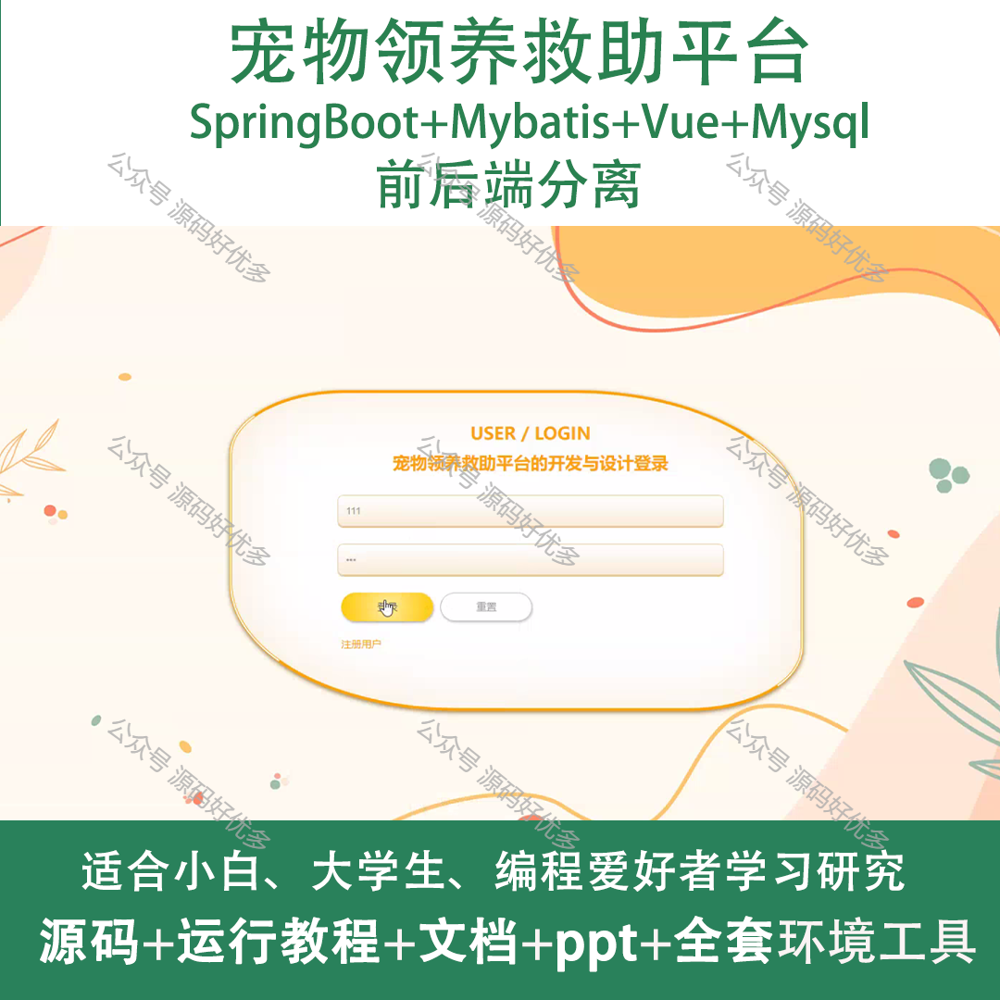
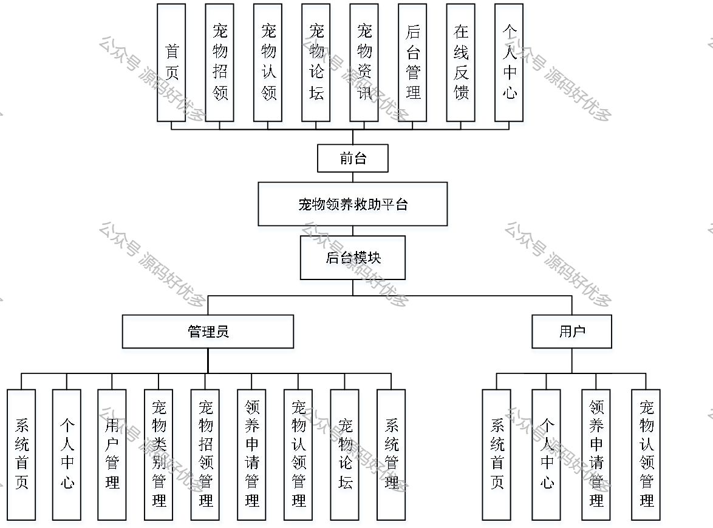
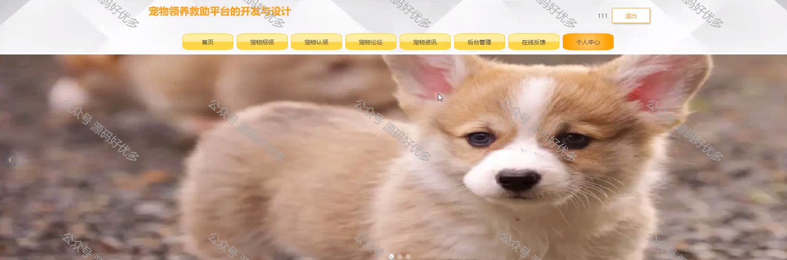
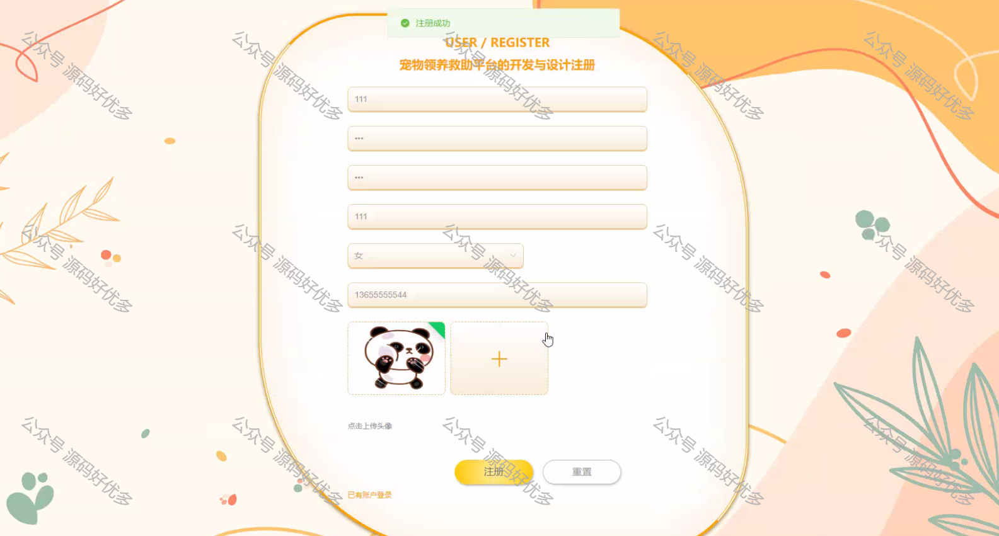
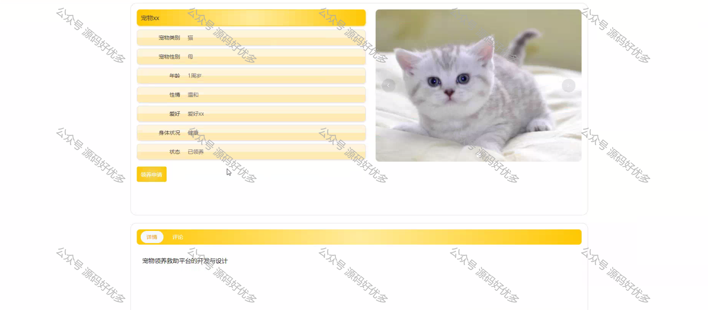
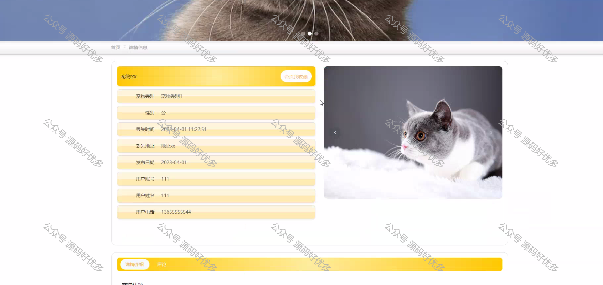
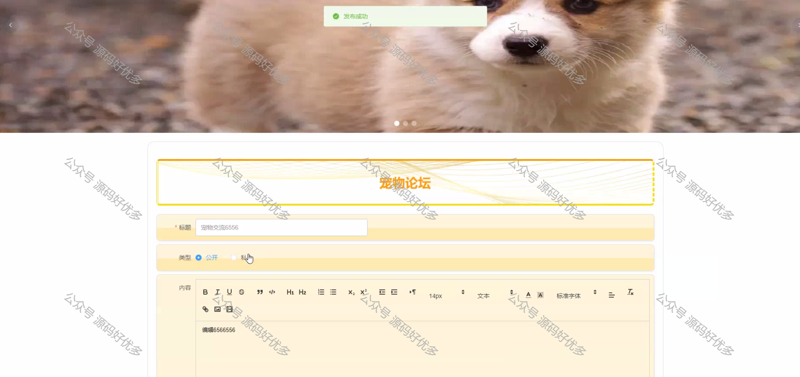
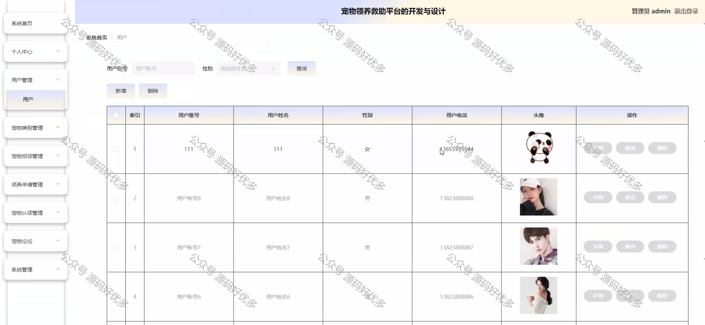
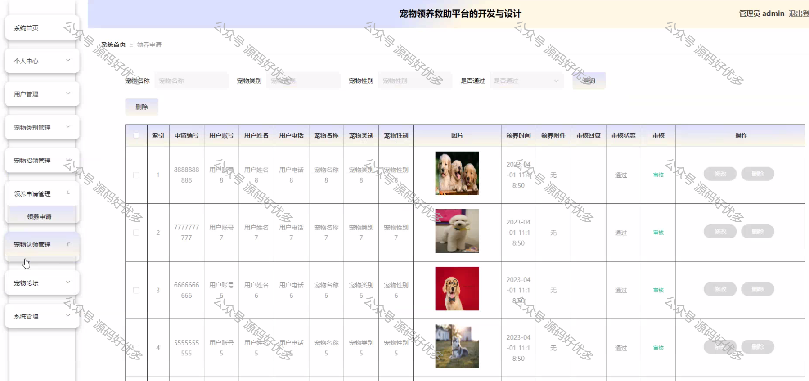

 
## 查看主页获取源码

> **作者介绍**： **✌**全网粉丝10W+本平台特邀作者、博客专家、CSDN新星计划导师、java领域优质创作者,博客之星、掘金/华为云/阿里云/InfoQ等平台优质作者、专注于项目实战 **✌**

  

### 一、作品包含

源码+数据库+设计文档万字+PPT+全套环境和工具资源+部署教程

### 二、项目技术

前端技术：Html、Css、Js、Vue、Element-ui

数据库：MySQL

后端技术：Java、Spring Boot、MyBatis

  

### 三、运行环境

开发工具：IDEA/eclipse

数据库：MySQL5.7

数据库管理工具：Navicat10以上版本

环境配置软件： JDK1.8+Maven3.6.3

前端Nodejs：14

  

### 四、项目介绍
项目编号：springbootA077

宠物领养救助平台采用B/S架构，数据库是MySQL。网站的搭建与开发采用了先进的java进行编写，使用了springboot框架。该系统从两个对象：由管理员和用户来对系统进行设计构建。主要功能包括：个人信息修改，对用户、宠物类别、宠物招领、领养申请、宠物认领、宠物论坛等功能进行管理。本系统在一般宠物领养救助平台的基础上增加了首页推送最新信息的功能，方便用户快速浏览，是一个高效的、动态的、交互友好的宠物领养救助平台。

### 五、运行截图

  
